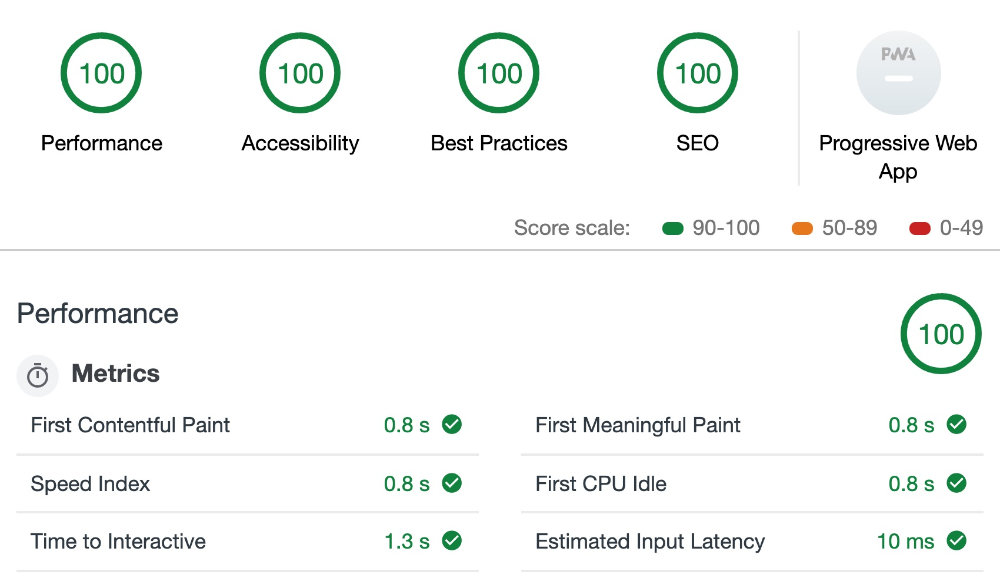

# InstaNews by Jeff Penner

Instanews features an API feed via The New York Times, with the website built using HTML, CSS and JavaScript and jQuery. This site was built based on mock-up photos provided of how the site should appear at 3 different media/screen sizes: 
- mobile, tablet and desktop. 

## Dependencies - Technical Elements

Aspects used to create this website:
Visual Studio Code
Google Chrome Developer Tools
HTML Validator (https://validator.w3.org/nu/#file)
CSS Validator (https://jigsaw.w3.org/css-validator/#validate_by_upload)
HTML\
CSS \
JavaScript\
jQuery \
SCSS/SASS\
AJax\
API feed via New York Times\
Git/GitHub\
Gulp\
Browser Sync\
Terminal \
Elements and attributes\
Doctypes, meta tags and comments\
Structure of a webpage knowledge\
Form elements\
Flexbox\
Classes and IDs\
Color and backgrounds\
CSS "reset" \
Icon Fonts\
Developer tools\
Responsive Web Design\
Mobile-first\
CSS3 properties\
Operators and Control Flow\
Functions

## What I Learned
In this project I learned how to properly execute the connection between jQuery and the Ajax API, as well as the importance of Accessibility (A11Y) and how to properly audit your code for best practices and SEO using Developer Tools. I was able to get the site to have 100% on it's Chrome Developer Tools audit:

## Stretch Goals
1. Each pulled article image is set to display at .85 and to display at 1 when the users hovers their mouse over it (obviously the idea behind this would be exclusive to desktop/mouse users).

Link to the site: hhttps://penner77.github.io/instaNews/
 

